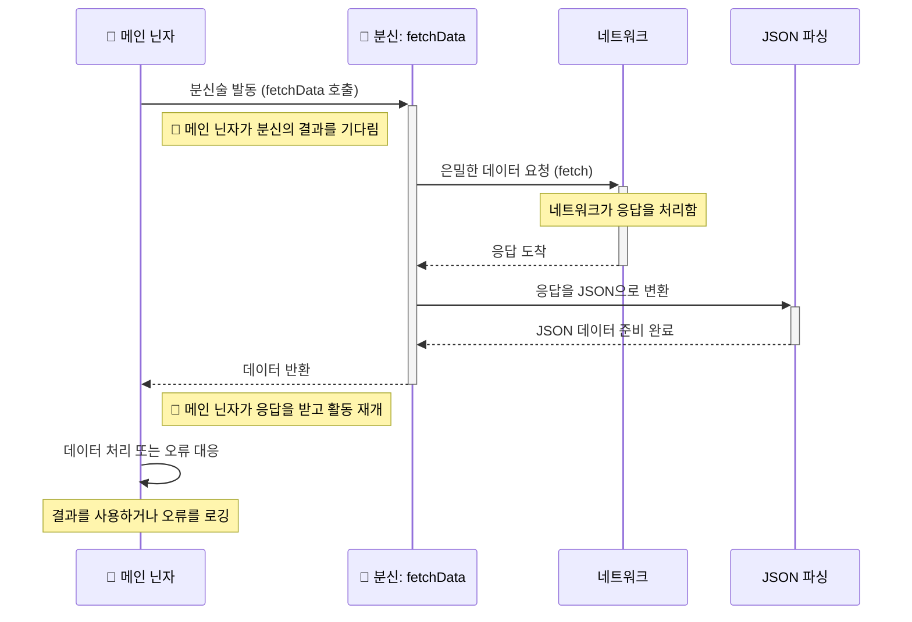

```html
<!doctype html>
<html lang="en">
<head>
    <meta charset="UTF-8">
    <meta name="viewport" content="width=device-width, user-scalable=no, initial-scale=1.0, maximum-scale=1.0, minimum-scale=1.0">
    <meta http-equiv="X-UA-Compatible" content="ie=edge">
    <title>사용자 정보 조회 앱</title>
</head>
<body>
<h1>사용자 정보 조회</h1>
<input type="number" id="userIdInput" placeholder="사용자 ID 입력">
<button onclick="fetchData()">사용자 정보 가져오기</button>
<div id="userInfo"></div>
<script>
    function fetchData(userId) {
        // fetch 함수를 사용하여 JSONPlaceholder에서 사용자 데이터를 가져옴
        return fetch(`https://jsonplaceholder.typicode.com/users/${userId}`) // 3번째 줄`
                .then((response) => {
                    if (!response.ok) {
                        throw new Error("Network response was not ok");
                    }
                    return response.json(); // 6번째 줄
                })
                .then((data) => {
                    // 사용자 정보를 HTML 요소에 표시
                    document.getElementById('userInfo').innerText = JSON.stringify(data, null, 2);
                })
                .catch((error) => {
                    console.error("Fetch error:", error); // 9번째 줄
                });
    }

    function fetchData() {
        // 입력 필드에서 사용자 ID를 가져옴
        const userId = document.getElementById('userIdInput').value;
        // 데이터 로드 호출
        fetchData(userId);
    }

</script>
</body>
</html>
```


## 참고 사항
- 다이어그램에서 세로 라인 중 두꺼운 부분은 호출한 부분에서 응답을 기다린다는 뜻입니다. :ninja:
