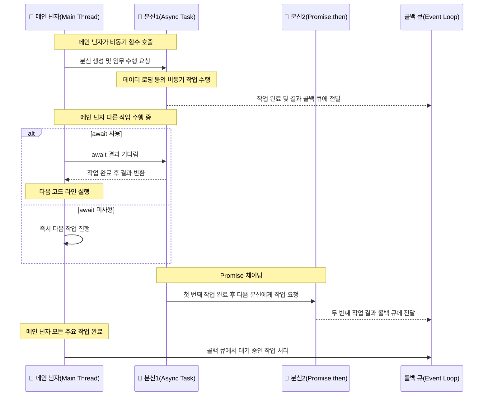

```mermaid
sequenceDiagram
    participant Main as 🥷 메인 닌자(Main Thread)
    participant Clone1 as 🥷 분신1(Async Task)
    participant Clone2 as 🥷 분신2(Promise.then)
    participant CallbackQueue as 콜백 큐(Event Loop)
    
    Note over Main, Clone1: 메인 닌자가 비동기 함수 호출
    Main->>Clone1: 분신 생성 및 임무 수행 요청
    Note over Clone1: 데이터 로딩 등의 비동기 작업 수행
    Clone1-->>CallbackQueue: 작업 완료 및 결과 콜백 큐에 전달
    Note over Main, Clone1: 메인 닌자 다른 작업 수행 중
    
    alt await 사용
        Main->>Clone1: await 결과 기다림
        Clone1-->>Main: 작업 완료 후 결과 반환
        Note over Main: 다음 코드 라인 실행
    else await 미사용
        Main->>Main: 즉시 다음 작업 진행
    end
    
    Note over Clone1, Clone2: Promise 체이닝
    Clone1->>Clone2: 첫 번째 작업 완료 후 다음 분신에게 작업 요청
    Clone2-->>CallbackQueue: 두 번째 작업 결과 콜백 큐에 전달
    
    Note over Main: 메인 닌자 모든 주요 작업 완료
    Main->>CallbackQueue: 콜백 큐에서 대기 중인 작업 처리


```
